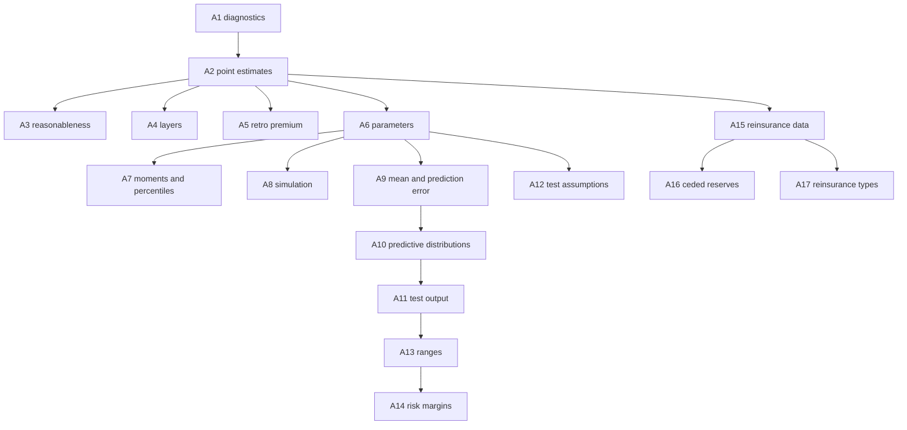

# Fall 2026 Exam 7 Syllabus Map

Official source: [Advanced Estimation of Claims Liabilities – Exam 7, Exam_7_CO_2026_F v02](https://www.casact.org/sites/default/files/2026-03/Exam_7_CO_2026_Fall.pdf)

Exam page: [casact.org/exam/exam-7-advanced-estimation-claims-liabilities](https://www.casact.org/exam/exam-7-advanced-estimation-claims-liabilities)

## Delivery

- Appointment time: 4.5 hours
- Exam: 4 hours 15 minutes
- Scheduled break: 15 minutes
- October 2026 window: October 19–27, 2026
- Register by: September 29, 2026

## Item types you may see

Multiple choice, multiple selection, point and click, fill in the blank, matching, constructed response, spreadsheet. Samples live on the Pearson VUE CAS page.

## Cognitive levels

| Level | Weight |
|---|---|
| Remember | 0–10% |
| Understand and Apply | 40–50% |
| Analyze and Evaluate | 40–50% |
| Create | 0–10% |

That mix is why this exam punishes “I memorized the formula” and rewards “I can say which method is wrong for this triangle and why.”

## Domain

**A. Estimation of Claims Liabilities — 100%**

Candidates apply basic Principles and Standards of Practice for unpaid claim estimation, including liabilities from complex risk transfer in excess insurance and reinsurance.

## The 17 tasks

Numbering below matches the A1–A17 codes used in the text-reference table.

### Data preparation, organization, and analysis

- **A1.** Perform data diagnostic analyses and adjust for data issues.

### Unpaid claim point estimates

- **A2.** Calculate unpaid claims estimates.
- **A3.** Test unpaid claim estimates for reasonableness.
- **A4.** Estimate unpaid claims for various layers of coverage.
- **A5.** Forecast premium reserves (for example, reserves for retrospective premiums).

### Unpaid claim stochastic distributions

- **A6.** Estimate parameters of unpaid claims distributions.
- **A7.** Calculate the moments and percentiles of unpaid claim distributions.
- **A8.** Simulate parameter percentiles and unpaid claims percentiles.
- **A9.** Calculate the mean and prediction error of a reserve.
- **A10.** Derive predictive distributions using stochastic methods.

### Unpaid claim output and diagnostic analysis

- **A11.** Test output of unpaid claim distributions for reasonableness.
- **A12.** Test assumptions underlying reserving models.
- **A13.** Develop a range of indications.
- **A14.** Calculate risk margins.

### Reinsurance

- **A15.** Adjust primary methods and data to be used for reinsurance reserving.
- **A16.** Calculate ceded loss reserves.
- **A17.** Describe the function and types of reinsurance.

## Readings and task map (Fall 2026)

| Abbreviation | Citation | Tasks | 2026 notes |
|---|---|---|---|
| Brosius | Brosius, E., “Loss Development Using Credibility,” CAS Study Note, March 1993 | A1–A3, A6, A11 | OP |
| Clark | Clark, D. R., “LDF Curve Fitting and Stochastic Reserving: A Maximum Likelihood Approach,” CAS Forum, Fall 2003 | A2–A3, A6–A8, A11 | OP |
| Friedland | Friedland, J. F., “Reserving for Reinsurance,” CAS Study Note, 2022 | A15–A17 | OP |
| Hurlimann | Hürlimann, W., “Credible Loss Ratio Claims Reserves: The Benktander, Neuhaus and Mack Methods Revisited,” ASTIN Bulletin 39(1), 2009, pp. 81–99, including errata | A1–A3, A6, A11 | **Not responsible for mathematical proofs** |
| Mack – Chain Ladder | Mack, T., “Measuring the Variability of Chain Ladder Reserve Estimates,” CAS Forum, Spring 1994 | A2, A6–A8 | OP |
| Mack – Benktander | Mack, T., “Credible Claims Reserve: The Benktander Method,” ASTIN Bulletin, 2000, pp. 333–337 | A1–A3, A9, A11–A12 | OP |
| Marshall et al. | Marshall, K.; Collings, S.; Hodson, M.; O’Dowd, C., “A Framework for Assessing Risk Margins,” IAAust 16th GI Seminar, 2008 | A14 | OP |
| Meyers | Meyers, G., “Stochastic Loss Reserving Using Bayesian MCMC Models (2nd edition),” **CAS Monograph #8**, including errata | A9–A11, A14 | **Not Monograph #1** |
| Sahasrabuddhe | Sahasrabuddhe, R., “Claims Development by Layer…,” CAS E-Forum, Fall 2010 Vol. 1, revised Jan 2, 2013, including errata | A4 | OP |
| Shapland | Shapland, M., “Using the ODP Bootstrap Model: A Practitioner’s Guide,” CAS Monograph #4, including errata | A1, A9–A11, A13 | Modeling files on pp. 61–62 aid understanding |
| Siewert | Siewert, J. J., “A Model for Reserving Workers Compensation High Deductibles,” CAS Forum, Summer 1996, pp. 217–244 | A4 | OP |
| Taylor | Taylor, G. and McGuire, G., “Stochastic Loss Reserving Using Generalized Linear Models,” CAS Monograph #3, **Chapters 1–6**, including errata | A9–A12 | **Ch 1–6, not 1–3** |
| Teng and Perkins | Teng, M. T. S., and Perkins, M. E., “Estimating the Premium Asset on Retrospectively Rated Policies,” PCAS LXXXIII, 1996, pp. 611–647, **excluding Section 5**; plus Feldblum discussion, PCAS LXXXV, 1998, pp. 274–315, **Sections 1 and 2 only** | A5 | No Annual Statement notation |
| Venter Factors | Venter, G. G., “Testing the Assumptions of Age-to-Age Factors,” PCAS LXXXV, 1998, pp. 807–847, including errata | A2, A6, A12 | OP |
| Verrall | Verrall, R. J., “Obtaining Predictive Distributions for Reserves Which Incorporate Expert Opinion,” Variance Vol. 1 Issue 1, 2007, including errata | A9, A13 | OP |

All of these are marked **OP** (online publication) in the official outline. There is no separate paid study kit for the required text references.

## Do not use older syllabus editions for these three items

1. **Meyers** is Monograph **#8, 2nd edition**. Older outlines listed Monograph #1.
2. **Taylor** is Chapters **1–6**. Older outlines listed Chapters 1–3.
3. Readings themselves were **not changed** from the October 2025 outline to the 2026 administrations (CAS posted a short-lived erroneous change notice in January 2026 and then withdrew it).

## How the series maps onto the tasks

Point-estimate papers (Brosius, Clark, Mack-Benktander, Hurlimann) feed A2/A3. Layer papers (Sahasrabuddhe, Siewert) are almost pure A4. Teng/Perkins is almost pure A5. Stochastic papers (Mack-CL, Clark, Taylor, Shapland, Meyers, Verrall) own A6–A13. Marshall and Meyers share A14. Friedland owns A15–A17.
